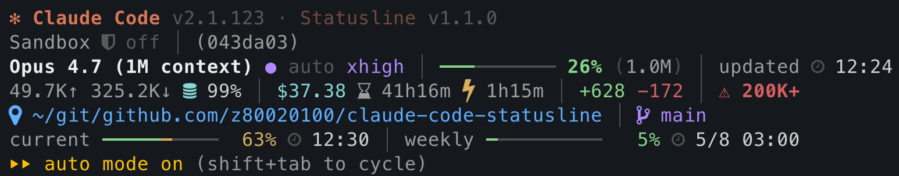
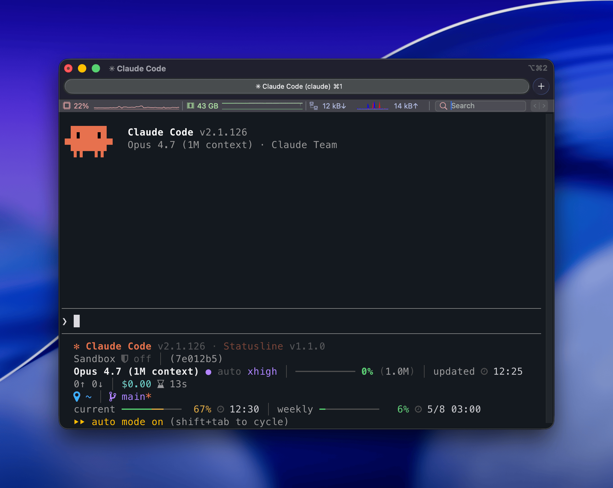
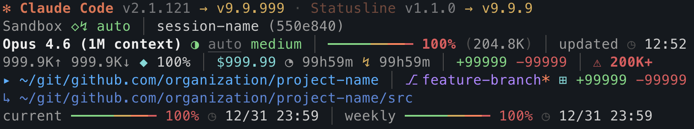

# claude-code-statusline

[](https://nodejs.org/) [](https://www.npmjs.com/package/@z80020100/claude-code-statusline)

[English](README.md) | [繁體中文](README.zh-TW.md) | [日本語](README.ja.md)

[Claude Code](https://docs.anthropic.com/en/docs/claude-code) 的自訂狀態列 — 顯示模型資訊、上下文使用量漸層條、Token 統計、費用、Git 狀態和使用量限制。



## Claude Code 中的呈現



## 使用指南

### 功能

- **上下文使用量漸層條** — 綠到紅的 4 段色彩頻譜
- **Token 與費用追蹤** — 輸入/輸出 Token 數、快取命中率、Session 費用
- **Session 計時** — 同時顯示實際時間與 API 回應時間
- **Git 整合** — 分支名稱、修改標記、worktree 指示器、與 main 的差異統計
- **使用量限制監控** — 當前 (5h) 和每週 (7d) 使用量及重置時間
- **Sandbox 指示器** — 顯示 sandbox 模式為關閉、開啟或自動
- **路徑壓縮** — 長路徑自動縮短以符合 80 欄限制
- **零執行時期依賴** — 僅使用 Node.js 內建模組

### 安裝

Claude Code plugin 為推薦安裝方式。npm 為替代方式。兩者皆會將相同的 `statusLine` 設定寫入 `~/.claude/settings.json`。

#### Claude Code plugin（推薦）

```sh
claude plugin marketplace add z80020100/claude-code-statusline
claude plugin install claude-code-statusline@claude-code-statusline
```

slash command 會從 npm 安裝最新版的 `@z80020100/claude-code-statusline`，然後寫入相同的 `command: "claude-code-statusline"` 設定。如果 npm 全域 bin 目錄不在 PATH 上，CLI 會印出包含修正指引的警告。請在 Claude Code 內執行：

```
/claude-code-statusline:setup
```

移除 `statusLine` 設定：

```
/claude-code-statusline:setup --uninstall
```

完整移除 plugin 與 marketplace：

```sh
claude plugin uninstall claude-code-statusline@claude-code-statusline
claude plugin marketplace remove claude-code-statusline
```

#### npm（替代方式）

```sh
npm install -g @z80020100/claude-code-statusline
claude-code-statusline setup
```

寫入的 `command` 為 `claude-code-statusline`（依靠 PATH 解析）：

```json
{
  "statusLine": {
    "type": "command",
    "command": "claude-code-statusline"
  }
}
```

移除設定：

```sh
claude-code-statusline setup --uninstall
```

### 圖示模式

圖示預設使用相容性最佳的純 Unicode 符號。

#### Plugin slash command（推薦）

```
/claude-code-statusline:icons
/claude-code-statusline:icons nerd
/claude-code-statusline:icons unicode
```

#### CLI（替代方式）

```sh
claude-code-statusline icons          # 顯示目前模式
claude-code-statusline icons nerd     # 使用 Nerd Font 圖示
claude-code-statusline icons unicode  # 使用 Unicode 圖示
```

兩者皆寫入 `~/.claude/claude-code-statusline.json`。設定 `CLAUDE_STATUSLINE_ICONS` 時仍會優先採用環境變數。

### 更新檢查

橫幅行始終顯示 Claude Code 和 Statusline 兩者目前的版本。更新檢查只控制每個版本後是否出現 `→ vX.Y.Z` 提示（當 npm `latest` 標籤比執行中版本新時）。兩項檢查預設皆為關閉，分別在分離的背景程序中執行每小時至多一次，結果快取於 `~/.claude/.cache/`。

- **Claude Code 更新檢查** — 監看 `@anthropic-ai/claude-code`。
- **Statusline 自我更新檢查** — 監看 `@z80020100/claude-code-statusline`。

#### Plugin slash command（推薦）

```
/claude-code-statusline:update-check
/claude-code-statusline:update-check on
/claude-code-statusline:update-check off
/claude-code-statusline:update-check claude on
/claude-code-statusline:update-check claude off
/claude-code-statusline:update-check statusline on
/claude-code-statusline:update-check statusline off
```

#### CLI（替代方式）

```sh
claude-code-statusline update-check                  # 顯示兩項狀態
claude-code-statusline update-check on               # 同時啟用兩項
claude-code-statusline update-check off              # 同時停用兩項
claude-code-statusline update-check claude on        # 啟用 Claude Code 檢查
claude-code-statusline update-check claude off       # 停用 Claude Code 檢查
claude-code-statusline update-check statusline on    # 啟用 statusline 自我檢查
claude-code-statusline update-check statusline off   # 停用 statusline 自我檢查
```

兩者皆寫入 `~/.claude/claude-code-statusline.json` 的 `updateCheck` 鍵。設定 `CLAUDE_STATUSLINE_UPDATE_CHECK`（`1` 或 `true` 啟用兩項檢查；其他值則停用）時仍會優先採用環境變數。

當指示器出現新版本時，依當初安裝方式升級：

- **Claude Code plugin** — `claude plugin update claude-code-statusline@claude-code-statusline` 並重新啟動 Claude Code。
- **npm** — `npm install -g @z80020100/claude-code-statusline@latest`。

### 顯示佈局

所有欄位最大寬度的呈現：



狀態列最多顯示 7 行 — 每行限制在 80 個可見字元內：

| 行  | 內容                                                                                |
| --- | ----------------------------------------------------------------------------------- |
| 1   | 版本橫幅：Claude Code 與 Statusline 兩者版本，各檢查啟用時於對應版本後加 `→ vX.Y.Z` |
| 2   | Sandbox 模式、session 名稱和 ID                                                     |
| 3   | 模型名稱、effort 等級、上下文使用量條與百分比、最後更新時間                         |
| 4   | Token 數 (輸入/輸出)、快取命中率、費用、session/API 持續時間、增減行數、200K 警告   |
| 5   | 專案目錄、git 分支、修改標記、worktree 指示器、與 main 的差異                       |
| 6   | 目前工作目錄（僅在與專案根目錄不同時顯示）                                          |
| 7   | 使用量限制 — 當前 (5h) 和每週 (7d) 使用量及重置時間                                 |

#### 色彩區間

上下文和使用量限制的進度條使用 4 段漸層：

| 範圍    | 顏色 | 意義 |
| ------- | ---- | ---- |
| 0–49%   | 綠色 | 正常 |
| 50–69%  | 金色 | 中等 |
| 70–89%  | 珊瑚 | 偏高 |
| 90–100% | 紅色 | 危險 |

### 系統需求

| 依賴        | Tier 1（CI 測試）                    | Tier 2（best-effort） |
| ----------- | ------------------------------------ | --------------------- |
| Node.js     | >= 20                                | 18                    |
| Claude Code | >= 2.1.80（需要 `rate_limits` 欄位） |                       |

## 開發指南

### 運作原理

Claude Code 在每次渲染時透過 stdin 傳入 JSON 物件給 `statusLine` 指令。JSON 包含目前的 session 狀態（模型、Token、費用、工作區、使用量限制等）。本工具解析後輸出 ANSI 彩色文字到 stdout。

設計決策：

- **零依賴** — 僅使用 Node.js 內建模組 (`fs`, `path`, `os`, `child_process`)
- **Git 快取** — 分支和差異統計快取 5 秒以避免重複呼叫子程序
- **設定快取** — effort 等級和 sandbox 模式使用 mtime 快取以減少檔案讀取
- **80 欄限制** — 由自動化測試強制執行；長路徑自動壓縮
- **256 色 ANSI** — 跨終端一致性渲染；Claude 品牌橘色使用 24-bit true color

### 開發

開發工具（ESLint 10、lint-staged 16）需要 Node >= 20.19，請參考 `.nvmrc`。

```sh
git clone https://github.com/z80020100/claude-code-statusline.git
cd claude-code-statusline
npm install                 # 同時透過 prepare 啟用 pre-commit hooks

npm run check               # lint + 格式檢查 + 寬度檢查 + CLI 測試
npm run fix                 # 自動修正 lint 和格式問題
npm test                    # 寬度檢查 + CLI 測試
npm run lint                # ESLint + shellcheck + actionlint
npm run simulate            # 渲染 worst-case 狀態列並顯示寬度報告
CLAUDE_STATUSLINE_ICONS=nerd npm run simulate  # 以 Nerd Font 字符渲染
npm run ci:local            # 透過 act 在本地執行 CI（需要 Docker）
```

## 授權

[MIT](LICENSE)
